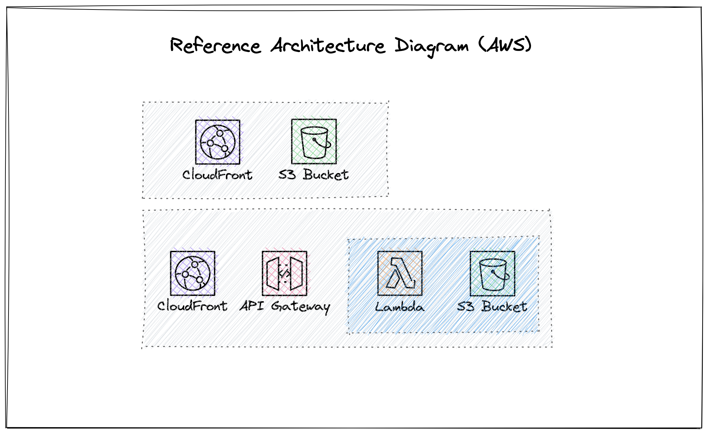

# Building Infrastructure With CDKTF

DevOps at the core is a culture that relies on shared responsibility and continuous collaboration between development
and operations of a product or service. In many organizations, a single multi-disciplinary team takes the complete
accountability to build and run. This socio, technological and organizational culture shift can be further empowered
and accelerated by leveraging technology stacks, programming languages and frameworks that are familiar to the entire team.

[CDKTF](https://developer.hashicorp.com/terraform/cdktf) (Cloud Development Kit for Terraform) is an Infrastructure as Code (IaC) framework that allows team to use
programming languages like TypeScript, Python, C#, Java etc. that are more familiar to developers to define and
manage infrastructure.

In this hands-on workshop, learn how to define and manage infrastructure using TypeScript,
one of the most popular languages to build full stack applications.

## Getting Started

### Prerequisites

In order to use CDKTF, you need:

- The [Terraform CLI](https://developer.hashicorp.com/terraform/tutorials/aws-get-started/install-cli) (1.1+).
- [Node.js](https://nodejs.org/) and npm v16+.

### Install CDKTF CLI

```bash
npm install --global cdktf-cli@latest
```

For more information and other installations options, you may checkout the [CDKTF CLI documentation](https://learn.hashicorp.com/tutorials/terraform/cdktf-install-cli).

### Setup AWS Credentials

You will need to have an AWS account and have your AWS credentials configured locally. You can find instructions on how to do this in the [AWS documentation](https://docs.aws.amazon.com/cli/latest/userguide/cli-configure-envvars.html).

```bash
export AWS_ACCESS_KEY_ID=
export AWS_SECRET_ACCESS_KEY=
export AWS_SESSION_TOKEN=
export AWS_DEFAULT_REGION=us-east-1
```

### Create an S3 Bucket to manage Terraform State

CDKTF uses Terraform as the underlying engine to provision infrastructure. Terraform stores the state of the infrastructure in a state file.
In this workshop, we will use an S3 bucket to store the state of the infrastructure.

```bash
# Create a new S3 bucket
aws s3api create-bucket \
    --bucket cdktf-workshop-tfstate \
    --region us-east-1
```

You may also use a local state file or Terraform Cloud to store the state information.

## What We Will Build

In this workshop, we will build a simple JAM Stack application, a sample ReactJS application
built as a static website that uses a serverless backend with a sample Lambda function and
API Gateway.



Optionally, we can setup custom domain name for the application using Route53 and ACM.

### Deploying the final application

```bash
# Install dependencies and Build UI for deployment
cd app && npm install && npm run build && cd ..

# Install dependencies for the lambda function
cd functions/mainfunc && npm install && cd ../..

# Install dependencies for the CDKTF project/providers
cd isc && npm install

# Sample code is setup with 3 environments: dev, test and demo
# Deploy the infrastructure for the demo environment
cdktf deploy demo

```

### Sample Output from the CDKTF CLI

```bash
  demo
    workshop-api
      Backend URL = https://XXX.execute-api.us-east-1.amazonaws.com/demo/public/welcome

    ui-deployment-demo
      website_endpoint = https://XXX.cloudfront.net
```

### Destroying the final application

```bash
# Destroy the infrastructure for the demo environment
cdktf destroy demo
```

#### Create a new environment

To create a new environment, create a new instance of the CDKTFWorkShop class with
appropriate name and details.

```typescript
new CDKTFWorkShop(app, "demo", {
  name: "cdktfworkshop-demo",
  environment: "demo", // Our Environment name, this tells us which stage to deploy and name
  region: "us-east-1",

  uiDeployment: true, // Let's us check in code if we need to deploy the UI or not
  uiBucketName: "workshop-demo.softrams.cloud", // If we are deploying the UI we need a bucketname for it.

  lambdaBucketName: "workshop-demo-lambda", // Setups our lambda bucket to store our zips

  setupDomain: false, // Again checks if a domain needs to be setup or not
  domainZoneId: "", // Setups up domain in correct zone should be pulled from domain zone in AWS
  ACMCertificateArn: "", // Sets up ACM certificate for our domain
});
```

## Resources

- [CDKTF Documentation](https://learn.hashicorp.com/tutorials/terraform/cdktf)
- TypeScript
  - [TypeScript Documentation](https://www.typescriptlang.org/docs/)
  - [TypeScript Handbook](https://www.typescriptlang.org/docs/handbook/intro.html)

## Contributing

If you have suggestions for how this workshop could be improved, or want to report a bug, open an issue! We'd love all and any contributions.
